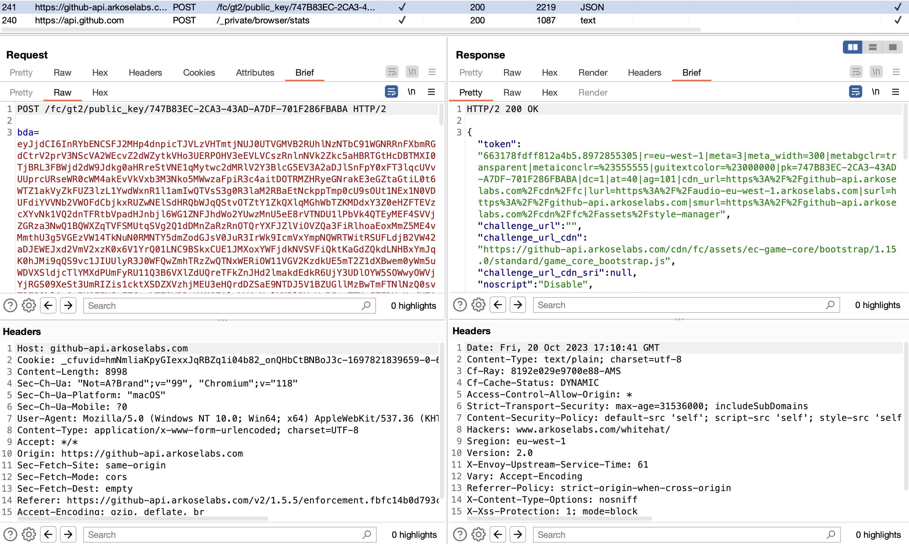

## Brief Editor Tab (Burp Suite Extension)

### Overview

Brief Editor Tab is a quality of life improvement for the Burp Suite that simplifies HTTP message editing. It creates a new tab, "Brief", where the headers and body of HTTP messages are displayed separately, making the content easier to view and manage.

Avoids a lot of scrolling on smaller screens.

### Usage

- After installation, a new tab named "Brief" will appear in the message editor sections of the Burp Suite
- In this tab, headers and the body of HTTP messages are displayed in distinct sections, allowing for straightforward editing without too much scrolling

### Contributing

Contributions are welcome. You can report issues or submit feature suggestions and improvements through pull requests.

### License

This project is licensed under the MIT License. See the LICENSE file for details.

